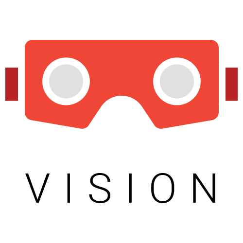

# VISION APP (WORK IN PROGRESS)

<br/>  
  
<br/>  
<br/>  
   
<br/>  

As ARCore will be heavily used in the near future for AR based apps, Vision as a sample Android app will be the demonstration of every feature and trick made possible by the ARCore Android SDK. Detailed documentation will be provided as well.

## LICENSE
 
``` 
Copyright 2019 Rami Jemli

Licensed under the Apache License, Version 2.0 (the "License");
you may not use this file except in compliance with the License.
You may obtain a copy of the License at

    http://www.apache.org/licenses/LICENSE-2.0

Unless required by applicable law or agreed to in writing, 
software distributed under the License is distributed on an "AS IS" BASIS, 
WITHOUT WARRANTIES OR CONDITIONS OF ANY KIND, either express or implied. 
See the License for the specific language governing permissions 
and limitations under the License.
``` 
